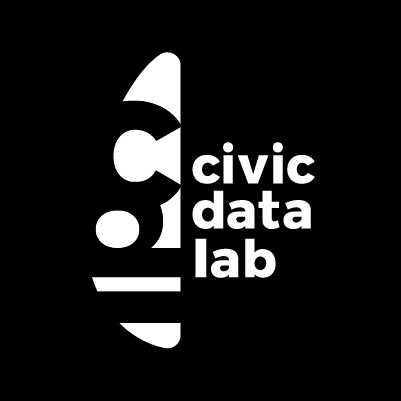

# 📖 Enabling Action for Attainment


#### Changes Under Progress ! 


### Team

* Akhil Sagiraju ; `Developer`
* Jatin Baghel ; `Product Designer`
* Nupura Gawde ; `Design Researcher`
* Deepthi Chand ; `Techology Lead`
* Arpit Arora ; `Project Lead`

### License

\
This work is licensed under a [Creative Commons Attribution 4.0 International License](http://creativecommons.org/licenses/by/4.0/). You can read more about the terms of the license of the linked page below.


[license.md](resources/license.md)


### Contact

For any queries related to the work please contact [education@civicdatalab.in](mailto:education@civicdatalab.in) .
