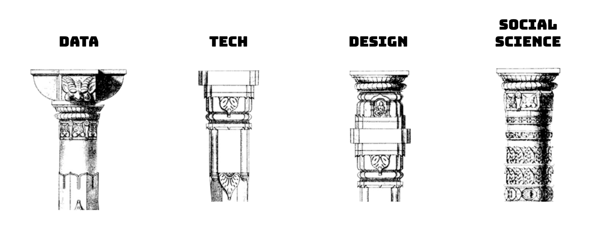

# 🔓 Approach

### The 4 Pillars

CivicDataLab believes in building solutions that harness the potential of open knowledge movements and better enable key stakeholders and citizens to engage in matters of public reform.&#x20;

To achieve this, all our research lies on the intersection of `data`, `tech`, `design` and `social science` to understand all aspects of the ecosystem and suggest solutions that strengthen the course of civic engagements.

* **Data** : Existing data sources used by key stakeholders to access neccesary information to support pupil in their regions. The nature of these datasets, the usage patterns of these datasets by key stakeholders and what sections of the ecosystem do they solve for.
* **Tech** : The feature of the existing platform and new features requested by the key stakeholders to fullfill their requirements of an ideal solution. The posstible data model, ad platfrom architecture of building such a system at scale.
* **Design** : Tools and platforms engaged by the key stakholders in the local authorities, how they are using these tools and for what puporses. The limitations of these existing tools and what would should be the features of the new solutions offered to them.
* **Social Science** : The most important aspect of the research is to understand the key stakeholders, what they day to day activities look like in the system and how they are interacting with all the pillars above and their requirements for an ideal solution.

You can learn more about how we have employed these four pillars in our work in the research section of this report.


[Broken link](broken-reference)


### Open by Default

We at CivicDataLab strongly believe that to build solutions that work for the community, the community should play an intergral role in their development. One key approach in achieving this goal is making all of our work open by default. All the work produced throughout this research has been made available under open licenses to use, reuse, contribute and extend the findings of our work with the community.

Keeping all our work open benefits us and the vision of the work in a couple of ways:

* Creating transparency in the approach taken for the research, enabling contributions.
* Ensuring that the solution co-created with the stakeholders is also co-owned by them.&#x20;
* Extending the work beyond the orignal creaters to take the efforts forward.

#### Licenses

**Content**

The research process and outputs in it's entirety is licensed under a [Creative Commons Attribution 4.0 International License](http://creativecommons.org/licenses/by/4.0/).

**Code**

The code writen to test and prototype envision solutions is kept under the [GNU Affero General Public License](https://www.gnu.org/licenses/agpl-3.0.en.html).

