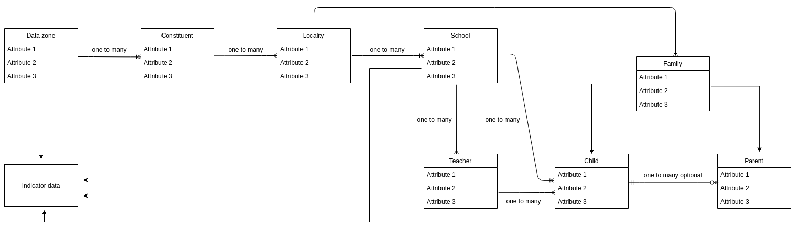

# Data Model

An important step in finding Find out the entitites from which data could be collected and map their relationships. The individual attributes of the entities may change once we get access to real data and start implementing the platform in phase 2 of the project.

Creating a hard and specific data model at this stage of the project is not reliable because:

1. CDL team does not have access either sample or real data that was already collected.
2. NORAL team is also not fully aware of the data collection process.

### Sources

### Model

#### Data Types

1. **Periodic** : Includes data that is usually changed/updated over a period of time and can contain Personally Identifiable Information (PII). Eg: budget allocation, population, expenses etc.
2. **Seldomly Updated** : Includes data that does not get updated frequently. May contain PII. Eg: highest education qualifications, reasons for dropping out of school etc.
3. **Facts** : Facts are data that remain unchanged. No PII. Eg: address of a school, regions, etc.
