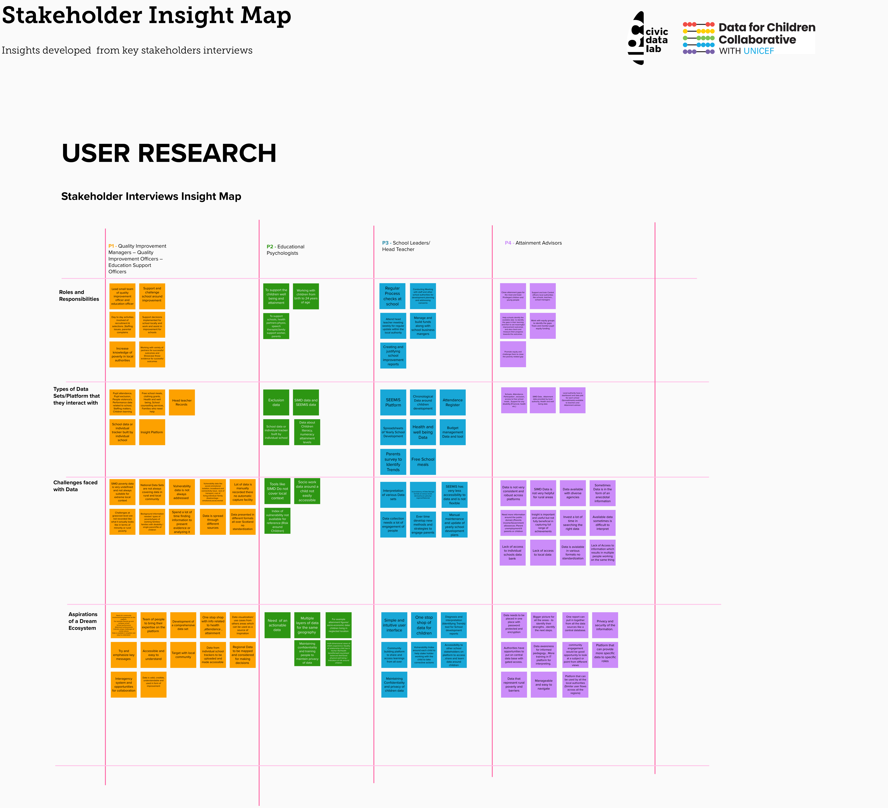

# Interviews

The main objective of Individual Stakeholder Interviews is to understand the role of access to information in solving poverty and attainment related gaps across the Northern Alliance Region of Scotland. These interviews focused on details related to individual stakeholder role & responsibilities, Stakeholder interaction with data or data sets, Challenges faced in the current system or data sets, Aspiration of the new platform and what all it should cover.

**Key areas of discussion with the Stakeholders:**

* Role of the stakeholder (What is the stakeholder accountable for in the ecosystem)
* What does a working day look like for the stakeholder? (What all activity he /she conducts or is involved in)
* What kind of data sets does the stakeholder interact with? (Names and description of data sets)
* How is that data beneficial for the stakeholder? (What purpose does the data solve and how does the stakeholder take corrective action based on it)
* What all challenges are faced by the stakeholder with respect to the ecosystem, frameworks or data?
* Dream and aspiration with respect to data and ecosystem (Expectations)

> The final interview script can be accessed [here](https://github.com/The-Data-for-Children-Collaborative/noral-user-research/blob/main/03-stakeholder-interviews/interview-script.md).

### Output

All the information from the interviews was synthesied and captured in Stakeholder Insight Maps capturing the roles and responsiblities, type of information they ineract with, challenges faces and aspirations of a dram ecosystem.

These outputs informed the creation of **user personas**, **journeys **and** wireframes** for primary and secondary stakeholders.


[personas-and-journeys.md](../../solution/personas-and-journeys.md)



[wireframes.md](../../solution/wireframes.md)


### Methodology

* An [information sheet](https://github.com/The-Data-for-Children-Collaborative/noral-user-research/blob/main/research/03-stakeholder-interviews/Participant%20Information%20Sheet%20-%20NORAL%20Project.pdf) was shared with the participants to outline the objectives and process of the interview.
* A [consent form](https://github.com/The-Data-for-Children-Collaborative/noral-user-research/blob/main/research/03-stakeholder-interviews/Participant%20Consent%20Form%20-%20NORAL%20Project.pdf) was shared with the participants articulating the terms of the interview and to prepare accordingly.
* The interviews spanned between 60-90 mins and were conducted over [Microsoft Teams](https://teams.microsoft.com).
