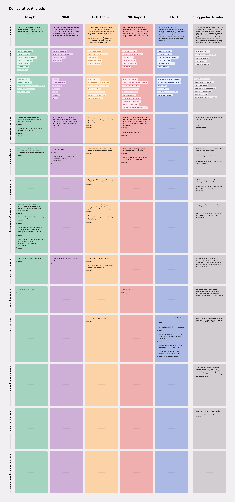

# 💡 Blueprint

The interviews helped us understand everyday processes of the key stakeholders better and generate User Personas and Journeys articulating your requirements from the new solution. Information generated from these interviews spoke about the their roles and responsibilities along with their challenges and aspirations in the system.


[personas-and-journeys.md](personas-and-journeys.md)


Similarly, we conducted comprehensive Design Audits of the existing platforms used by the key stakeholders, thoroughly examining all elements of the digital product based on their business objectives, metrics, and usability standards. These listed down the areas of improvement and recommend solutions to improve the overall experience.


[design-audit.md](../research/existing-tools-review/design-audit.md)


To understand the requirements of the new suggested solution we borrow our learnings from the user personas / journeys and design audit to define the broad feature set and functionalities. These functionalities are compared to the existing tools in the ecosystem to identify the strengths, gaps and build according to that information.

### **Comparative Analysis**

A comparative analysis is a strategy where you identify major existing platforms which are trying or have tried to solve problems for more or less the same problem statement. You compare common features for each platform whether they stand in advantage or disadvantage for the users. Also not to forget special features offered by each platform which are their USPs .

Advantages of Comparative Analysis:

* Comparative analysis can reveal broad trends in the existing platform , again providing the advantage of being able to spot opportunities for differentiating dos and don'ts.
* Helps you identify your solutions unique value proposition and what makes your solution different from others.
* Provides you with a benchmark against which you can measure your solution success.

By conducting the comparative analysis of the existing platforms we derived feature level comparison of what the existing platforms has to offer. Analysis was done on common feature to feature comparison keeping in mind the most important and necessary features that are accessed by the users. These exercises helped us understand the following questions:

* What is available for the user?
* What is working for the user?
* What can be changed ?
* What can be combined ?
* What can be added?

The comparative analysis of the existing platforms to envision a new solution can be found below:

### Feature List

During the stakeholderinterviews every stakeholder shared their narrative about the platform they have worked with and platform that they aspire to work with.&#x20;

Few terms that constantly came forward as their aspirations like ‘One Stop Shop, Data literacy for all or Data standardization etc.’ These suggestions we have picked and have tried working further which are included as our features or functions in the new solution.

### Problem Statement

Every good solution starts with a good problem statement hence we decided to work with 5 W and 1 H Framework. It stands for Who, What, When, Where, Why, and How. Asking relevant questions starting with these interrogative words can streamline the problem solving process. The 5 W 1H framework also sets the context to the bigger picture for which we are trying to solve the problem.

**Defining the Problem Statement**

> _**What - What starts by defining what the problem is?**_&#x20;

To bridge the gap between access to information which can assist stakeholders to understand the attainment related gap around children due to poverty.

> _**Who - Who is trying to solve the problem?**_&#x20;

[CivicDataLab](https://civicdatalab.in) is partnering with [The Data for Children Collaborative](https://www.dataforchildrencollaborative.com) to determine what data sources and techniques can best reflect the challenges of child poverty, and subsequently provide means to assess poverty related attainment gaps.

> _**Where - Where is the problem situated?**_&#x20;

The problem is addressed across the Northern Alliance region of Scotland

> _**Whom - For whom are we trying to solve the problem?**_&#x20;

The Northern Alliance Education system has Primary and Secondary stakeholders. Primary stakeholders are ones who have direct engagement and impact with systems like Attainment Advisors, Quality Improvement Officers , Head Teachers and Educational Psychologists. Secondary stakeholders can be defined as stakeholders who have indirect effect or impact like Research Assistants, NIF advisors etc.

> _**Why - What is the purpose of Solving this problem?**_

The major goal here is to enable key stakeholders to use data in understanding the role of poverty in a child’s education.

> _**How - How are we trying to address this problem?**_

The problem can be addressed by leveraging a platform that caters to individual needs of the stakeholders and empowers them to share their learnings.

### Scoping

By defining the problem statement it helped us to define the purpose and objective of the larger context for which we are solving the problem for. It also helped in scoping the future path to build the narrative for the proposed new solution which we will see below. Through these exercises, we were able to identify the following key areas for the envisioned solution.

> Ensuring **Security and Privacy** as the Data around children and Education system is extremely sensitive

> **Map view** enhances layering of various information related to the stakeholder in a map view. It can be data of the local authority or school which is plotted on the map and provide additional information. Users connect to geographic information on higher basis

> **Dashboards** caters to Key performance Indicators for better forecasting and decision making which will help the stakeholders to be vigilant and thoughtful

> The power to empower our users is leveraged by **Data Explorer**. It allows users to explore and showcase specific analyses, reports, stories, etc. for various use cases with the methodology and the data made accessible for further research.

> **Benchmarking** is an asset for users to identify the performance of the systems with which they are associated in comparison to other hierarchical systems.This can happen through our Data Comparator

> Users are liberated when they can **share** their learning with other sets of users about their experiences, processes and outcomes. It encourages parallel learning within the ecosystem.

The above features were then used and detailed as per the individual user requirements catering to their needs and day to day activities around data and functionality.

Broader level user flows were generated as a brainstorming exercise to understand the following things:

1. Broad level Information Architecture
2. Hierarchy
3. Navigation
4. Functionality of the feature
