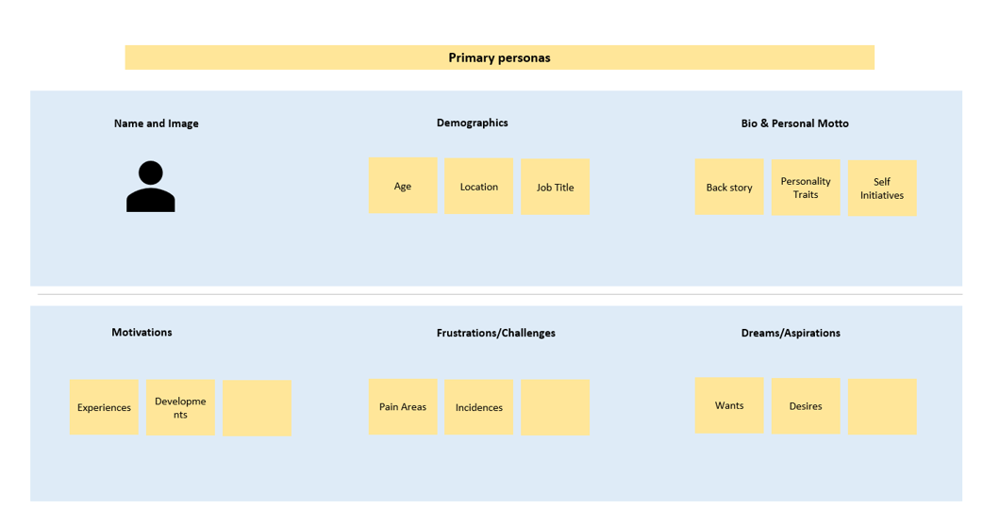
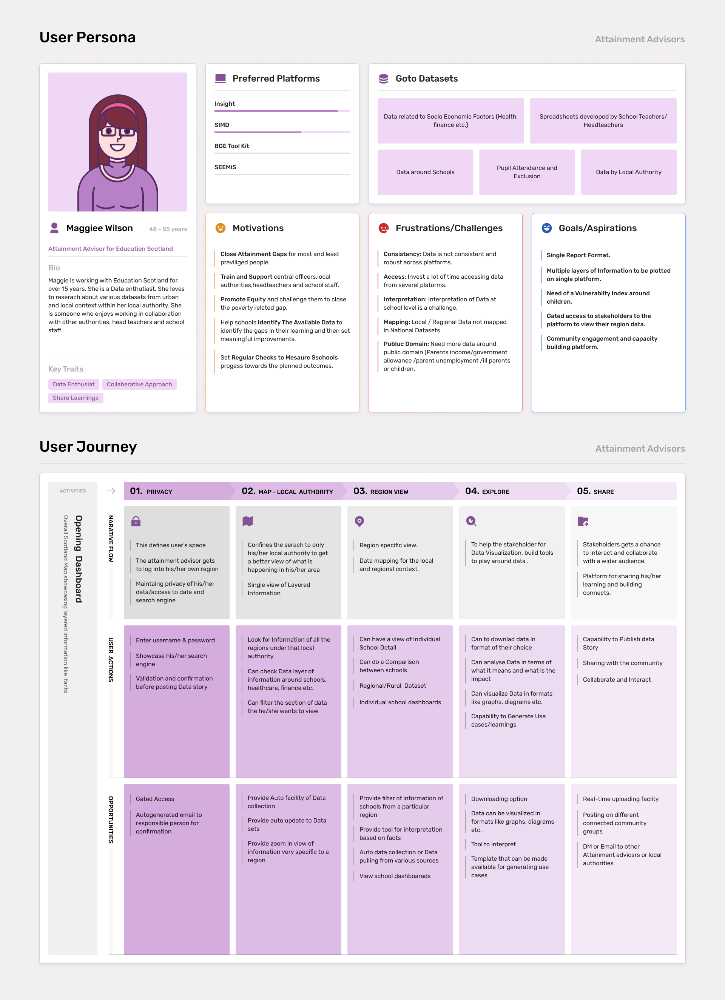
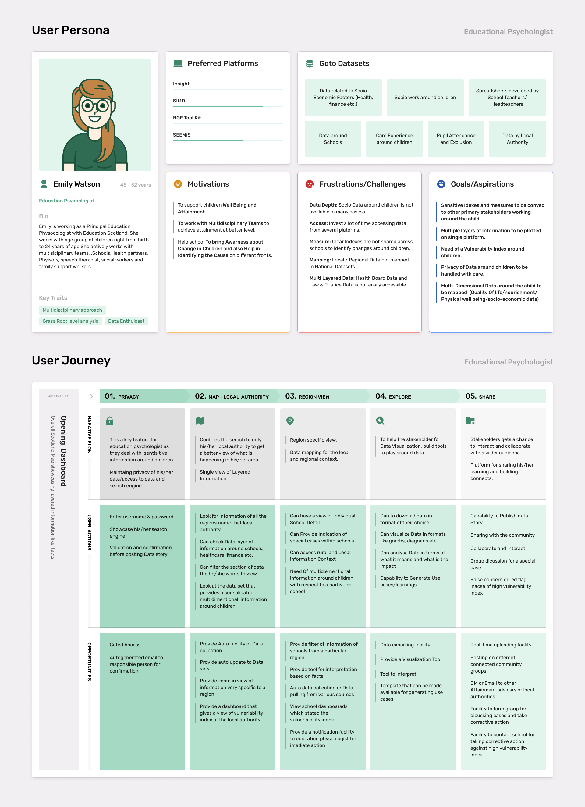
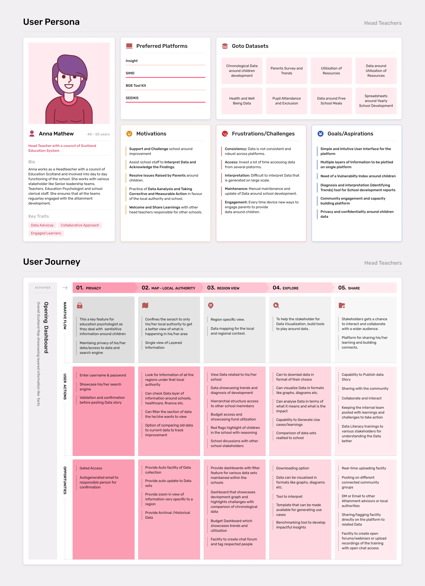
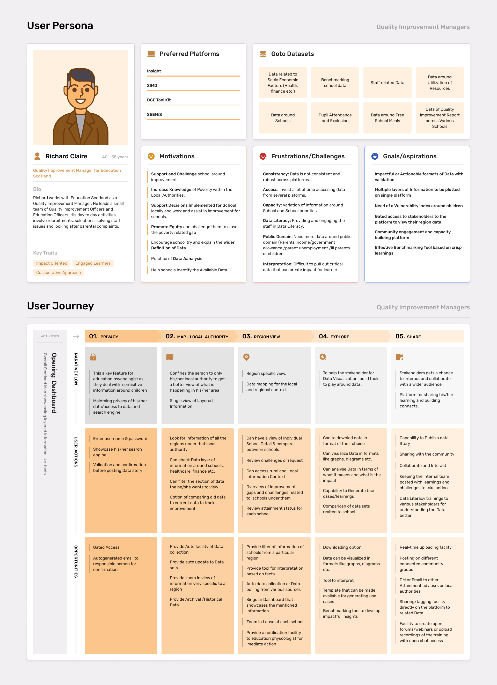

# Personas and Journeys

### Personas

Data generated from key stakeholder during interviews highlighted their individual people roles and responsibilities along with their challenges and aspirations. The data gathered was clustered into inputs and insights to form a set of target primary and secondary stakeholder requirements.

Creating personas will help to understand users' needs, experiences, behaviours and goals. It can help to recognise that different people have different needs and expectations, and it can also help to identify with the user you're designing for. Personas can be supported with Stakeholder Insight Map generated from Stakeholder Interviews.


[interviews.md](../research/stakeholder-engagement/interviews.md)


#### **Framework**

The personas contain the following information about the stakeholders:

* **Name**: Could be realistic, could be taken from an actual customer, or it could be a descriptive handle like “Sally the Thrift-shopper.”
* **Job Responsibilities**: Provide details related to roles and responsibilities.
* **Photo**: It always helps to put a face to a name. Stock photos are fine, but avoid photos of celebrities, co-workers or other familiar faces that may come with built-in connotations and assumptions. The idea is creating a new, original identity.
* **Personal Quote / Motto**: Just like a photo, this helps flesh out the persona to make them seem more real.
* **Bio**: Give a little backstory to make the person relatable. What was their childhood like? Why did they choose their current job? How do they spend their free time? These tiny details could influence strategic choices down the road.
* **Demographics**: Age, sex, income, location—whatever attributes are relevant to your industry. Job title is particularly important, considering its business and financial implications.
* **Personality Traits/Self initiatives**: People with low attention spans want faster site designs. Cautious people are most likely to compare shops. Personality traits are one of the most useful features of personas, so choose these with care.
* **Motivations** (Specifically to what data is for them): Like personality traits, this helps you get inside the customer’s head and understand how they think. For example, would a customer be more likely to buy a product that improves their career or their personal life? It depends on which motivates them more.
* **Frustrations / Challenges**: The scope of these is in direct relation to your needs. A lifestyle company would keep to general life and career goals, while a tech company could hone in on more specific goals like tasks they hope to accomplish with their software.
* **Preferred Platforms**: You can tell a lot about a person based on which brands they like and what kind of people influence their decisions. You can also look at those brands’ marketing strategies to see if their tactics might apply to you as well. · **Goals**: Dream Ecosystem or Dream platform to help them take data driven decisions

### Journeys

Data generated from Stakeholder Surveys and Workshops primarily addressed Stakeholder preferences in terms of platform use and feature feedback. Preferences needed a prioritization framework to develop the user journeys for each stakeholder.

Following is the applicable prioritization framework used.

#### **MosCoW Prioritization Framework**

MoSCoW prioritization, also known as the MoSCoW method or MoSCoW analysis, is a popular prioritization technique for managing requirements. The method is commonly used to help key stakeholders understand the significance of initiatives in a specific release. MoSCoW stands for four different categories of initiatives: must-haves, should-haves, could-haves, and will not have. Sometimes, the “W” in MoSCoW is used to stand for “wish” instead of “will not have right now.”

**Why MosCoW Prioritization Framework?**

MoSCoW prioritization, will help in feature prioritization for the platform. Features can be prioritized for each stakeholder based on their requirements and needs. This prioritization will be developed based on the qualitative comments /resources received from the interviews and workshops.

Based on the Stakeholder Prioritization Framework and Personas we develop the user journeys maps for each stakeholder.

A **User Journey Map** (also known as a customer journey map) is a diagram that visually illustrates the user flow through your platform, starting with initial contact or discovery, and continuing through the process of engagement into long-term loyalty and advocacy.

**Advantages **: The process of mapping their journey encourages and reminds them to consider the entire user experience: their feelings, questions and needs while they interact with the platform. It’s used for understanding and addressing customer needs and pain points. What is the user thinking about and what are they hoping to achieve?

### Outputs

The Personas and Journeys for all the key primary and secondary stakeholders are below.























### Way Forward

Stakeholder analysis uncovers and removes multiple barriers in understanding the project's progression, stakeholder analysis. It also eliminates the roadblocks in releasing successful projects by getting information about project supporters, opponents, and their levels of importance in the project. By using the consolidation methods of personas and user journeys we plan to achieve the following steps ahead:

1. User journeys will help in further building wireframes of each stakeholder for the platform.
2. It will address the needs and aspiration along with user action which the platform can cover.
3. It will also scope the space of opportunities that can be achieved as per user needs.
