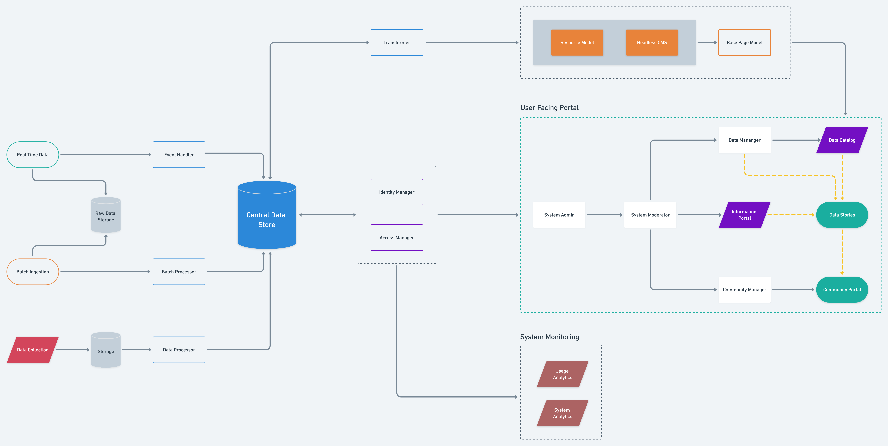

# Platform Architecture

The techology arrchitecture of the platform has been driven by the understanding through the following threads:

* Intention and Objective of the suggested new platform and how it's functionalities have been inspired by the landscape of existing tools.


[blueprint.md](../blueprint.md)


* Possible journeys various stakeholders might take through the platform and how they will engage with various pieces of the solution.


[personas-and-journeys.md](../personas-and-journeys.md)


* The features of individual pages of the platforms, the challenges they are addressing and the ways a user can manouver through the information.


[wireframes](../wireframes/)


Based on these inputs, the architecture has four basic components:

* Data Sourcing
* Data Storage
* User Facing Portals
* Monitoring and Analysis

### Components

#### Data Sourcing

Based on the requirments of the stakeholders from a new and the possible datasets in scope identified by the University of Strathclyde through their research, the system would support sourcing of data from three different processes:

1. Direct bulk upload of datasets by system maintainers.
2. Data collected on ground through primary data collection methods.
3. Data periodically updated via automated processes through APIs.

#### Data Storage

To support the various sources of data, the system contains various data storage capabilities at different levels of the platform.

* Each component in the system would have a temporary storage to enable faster data access and processing.
* All datasets are stored pre and post processing to enable higher resilience against data loss.&#x20;
* The central datastore manages the processing, indexing, caching and archival of data.
* A knowledge graph of all the base truths in the system is maintained to enable information mapping against mutiple data sources.

#### User Facing Portals

Catering to the requirements of the key stakeholders, these are some of the components of the user facing portal:

* **Information Portal **: Pre-set of landing pages, visualisations and more catered to the requirements of each of the key stakeholder buckets.
* **Data Catalog** : Repository of the all datasets available on the plaform to various users based on their access rights to explore, visualise, share and more.
* **Data Stories** : Capability to use existing data and visualisations, and stitch naratives around the same which can be published on the platform.
* **Community Portal** : A central portal for variopus stakeholders of the communicy to come together, share relevant information and support each other in build capacity.
* **System Moderation Control Panel** :&#x20;
* **Data Management Platform** : Access platform available to key data fiduciaries to provide access to relevant datasets based on requirements and eligibility of the users.

#### Monitoring and Analysis

The system would be equipped with central monitoring system to monitor workflows between all the components of the system.&#x20;

* This system would allow manual interventions and policy enforcement for platform use.&#x20;
* The processed data will also be available to analyse all the datasets present in the system.

### Methodology

The key thread across the entire solution architecture is that none the technologies suggested to achieve this solution are proprietory in nature. All the code, tools and technologies produced will be open sourced by default and available under on licenses in public repositories.
