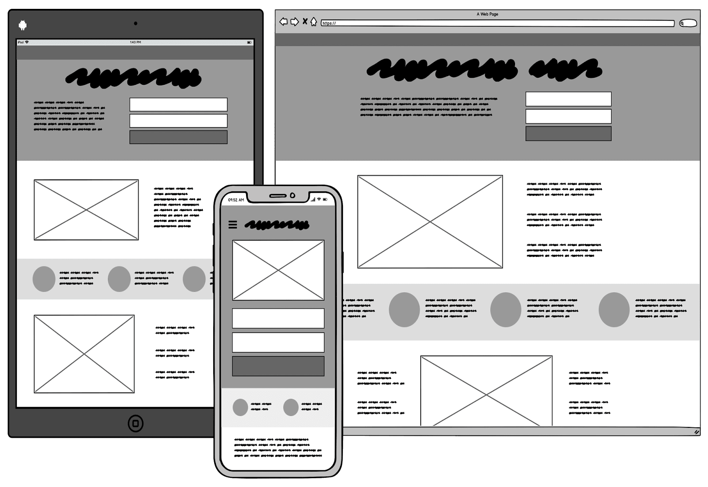

# 📑 Wireframes

Keeping in mind all the insights we have gained from the several stakeholder engagements, we have generated the preliminary wireframes for the suggested platform. With the help of user flows we can envision, how the platform will shape for each stakeholder.&#x20;

### What are Wireframes?

A wireframe is a schematic or blueprint that is useful for helping you, or your stakeholders to  think, communicate and review  about the structure of the platform you're building.

### Why are we Showcasing Wireframes?

* **Wireframes make it clear that this is not the final design** : No one could mistake a wireframe for the final look and feel of your application. Low-fidelity and few colors force you to focus on structure over details. There will be lots of time for visual design once the structure is finalized.
* **Wireframes convey that “this is all up for discussion”** : The rough feel encourages discussion. We call it a look no one is afraid to criticize. Wireframes are really quick to make, so don't be shy with giving feedback! Each screen probably only took a few minutes to make; don't worry, their author won't mind doing them over from scratch. What matters the most at this point is the final ease of use, so going through a few iterations is normal and expected.
* **Wireframes make it clear that no code has been written yet** : If a stakeholder received some screens that looked like screenshots of the final app, instead of a wireframe, they might assume that all the code behind those screenshots had already been written. This is most often not the case. Wireframes don't have this danger.

### Suggested Wireframes

#### By View



> `Aimed at Attainment Advisors and Quality Improvment Teams.`




> `Aimed at Quality Improvment Teams and Educational Psychologists.`




> `Aimed at Head Teachers and Educational Psychologists.`




#### By Function












The wireframes are currently undergoing a feedback process from the stakeholders.

